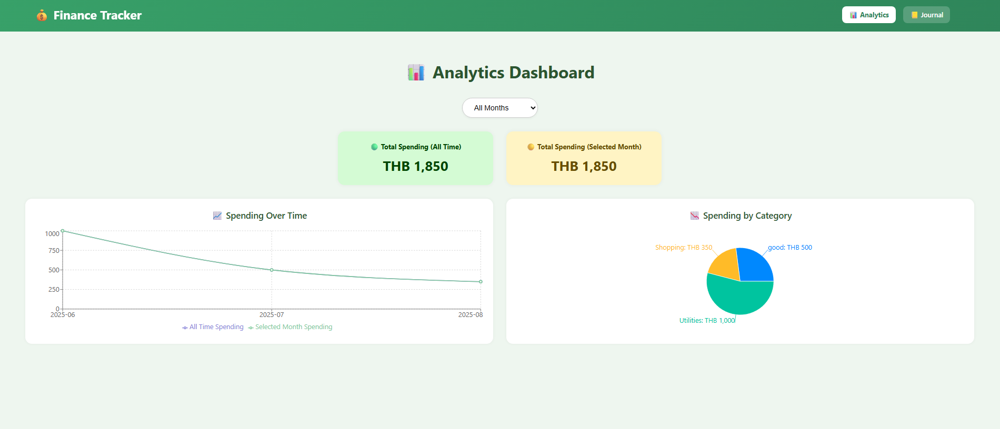
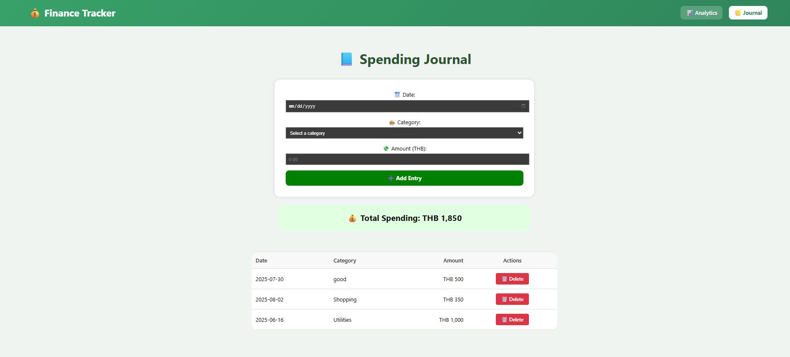

# Finance App

# Members
Anuson Khwansakun
Tihong Chhiv

A modern, single-user finance tracking application built with React and Vite. Track your spending, analyze your financial patterns, and manage your budget with charts and intuitive interface.

## Features

### 📊 Analytics Dashboard
- **Time Period Selection**: View spending data by Daily, Weekly, Monthly, or Yearly periods
- **Month Filtering**: Filter data by specific months or view all-time data
- **Total Spending Summary**: 
  - All-time total spending
  - Selected month total spending
- **Interactive Charts**:
  - **Line Chart**: Shows spending trends over time (all-time vs selected month)
  - **Pie Chart**: Displays spending breakdown by category
  - **Bar Chart**: Visualizes spending by selected time period (Daily/Weekly/Monthly/Yearly)

### 📘 Journal Page
- **Easy Entry Management**: Add spending records with date, category, and amount
- **Predefined Categories**: Use built-in spending categories from `spending-category.json`
- **Custom Categories**: Add your own spending categories that persist in the app
- **Data Validation**: Form validation ensures all required fields are filled
- **Entry Management**: View, add, and delete spending entries
- **Real-time Total**: See your total spending update in real-time

### 🎨 Modern UI/UX
- **Responsive Design**: Works seamlessly on desktop and mobile devices
- **Beautiful Charts**: Powered by Recharts for professional data visualization
- **Intuitive Navigation**: Clean navigation between Analytics and Journal pages
- **Local Storage**: All data is saved locally in your browser

## Getting Started

### Prerequisites
- Node.js (version 14 or higher)
- npm or yarn

### Installation

1. Clone the repository or navigate to the project directory
2. Install dependencies:
   ```bash
   npm install
   ```

3. Start the development server:
   ```bash
   npm run dev
   ```

4. Open your browser and navigate to `http://localhost:5173`

## Usage

### Adding Spending Entries
1. Navigate to the **Journal** page
2. Fill in the required fields:
   - **Date**: Select the date of your spending
   - **Category**: Choose from predefined categories or add a custom one
   - **Amount**: Enter the amount in THB
3. Click "Add Entry" to save your record

### Adding Custom Categories
1. In the Journal page, select "➕ Add Custom Category" from the category dropdown
2. Enter your custom category name
3. Click "Save Category" to add it to your list
4. Your custom categories will be saved and available for future use

### Analyzing Your Spending
1. Navigate to the **Analytics** page
2. Use the dropdown menus to:
   - Select a specific month or "All Months"
   - Choose your preferred time period view (Daily/Weekly/Monthly/Yearly)
3. Explore the different charts:
   - **Line Chart**: See spending trends over time
   - **Pie Chart**: Understand your spending by category
   - **Bar Chart**: View spending patterns by time period

## Data Storage

- All spending entries are stored in your browser's localStorage
- Custom categories are also saved locally
- No data is sent to external servers - your financial data stays private

## File Structure

```
src/
├── components/
│   ├── Navigation.jsx      # Main navigation component
│   └── Navigation.css      # Navigation styles
├── pages/
│   ├── Analytics.jsx       # Analytics dashboard
│   ├── Analytics.css       # Analytics styles
│   ├── Journal.jsx         # Spending journal
│   └── Journal.css         # Journal styles
├── App.jsx                 # Main app component
├── App.css                 # App styles
├── main.jsx               # App entry point
└── index.css              # Global styles

public/
└── spending-category.json  # Predefined spending categories
```

## Technologies Used

- **React 19**: Modern React with hooks
- **Vite**: Fast build tool and development server
- **React Router**: Client-side routing
- **Recharts**: Professional chart library
- **LocalStorage**: Client-side data persistence

## Available Scripts

- `npm run dev` - Start development server
- `npm run build` - Build for production
- `npm run preview` - Preview production build
- `npm run lint` - Run ESLint

## Browser Support

This app works in all modern browsers that support:
- ES6+ JavaScript
- CSS Grid and Flexbox
- LocalStorage API

## Contributing

This is a single-user application designed for personal finance tracking. Feel free to modify and customize it for your own needs!

## License

This project is open source and available under the MIT License.

## Screenshots

### Analytics Dashboard


### Journal Page

